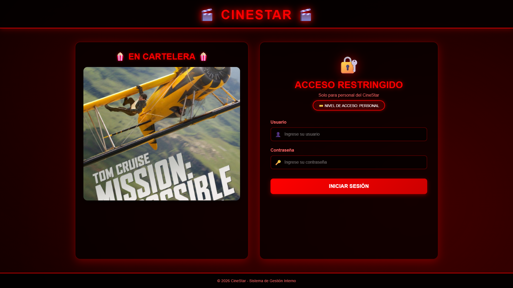
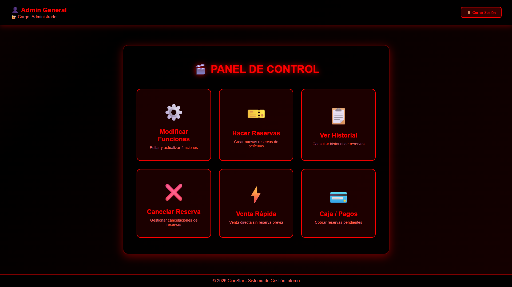
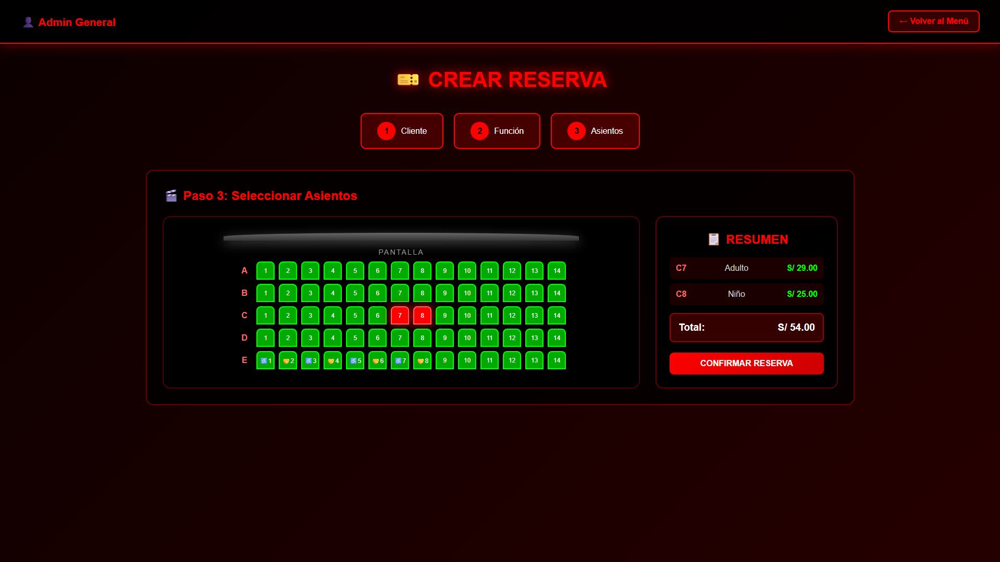
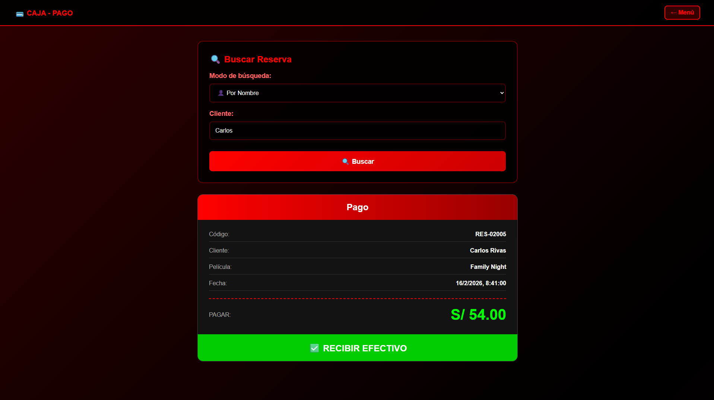
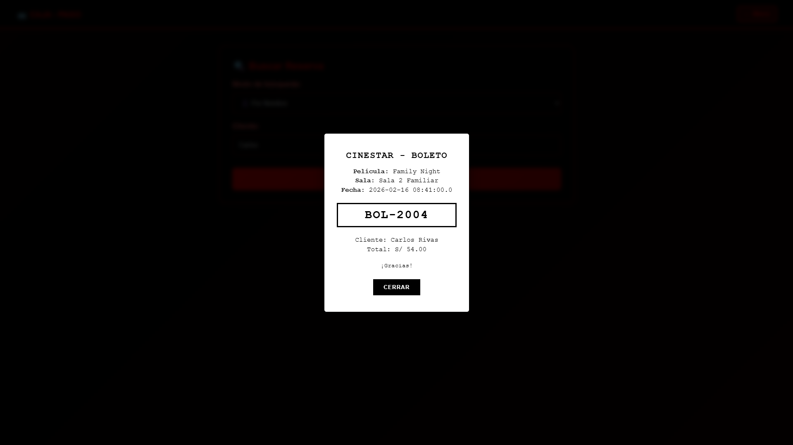

# 🎬 CineStarBarrio - Sistema de Gestión de Cine

Sistema web desarrollado con Spring Boot para la gestión de un cine.
Permite administrar películas, usuarios y la compra de entradas mediante un sistema con roles.

---

## 🚀 Tecnologías utilizadas

- Java
- Spring Boot
- Maven
- SQL Server
- HTML
- CSS
- JavaScript

---

## 🔐 Funcionalidades principales

### Usuarios
- Registro e inicio de sesión
- Autenticación con roles (Administrador / Cliente)
- Compra de entradas

### Gestión de Películas (Administrador)
- Crear películas
- Editar información
- Eliminar registros
- Visualización en cartelera

### Sistema de Compra
- Selección de película
- Registro de entradas
- Gestión desde base de datos

---

## 🗂 Estructura del Proyecto

src/
- main/
  - java/ (Controladores, Servicios, Entidades)
  - resources/ (Vistas HTML y configuración)
- test/

---

## ⚙️ Instalación y ejecución

1. Clonar el repositorio:
git clone https://github.com/lamascara-17/CINEMA-PROJECT_17.git

2. Configurar la base de datos SQL Server

3. Actualizar credenciales en application.properties

4. Ejecutar con Maven:
mvn spring-boot:run

---
## 📚 Objetivo del Proyecto

Proyecto académico orientado al desarrollo de una aplicación web completa bajo arquitectura MVC, integrando:

- Desarrollo Backend con Spring Boot
- Implementación de lógica de negocio y controladores REST
- Persistencia de datos con SQL Server
- Diseño y desarrollo de interfaz Frontend con HTML, CSS y JavaScript
- Implementación de autenticación y autorización basada en roles
- Integración entre capa de presentación y capa de datos

El objetivo fue aplicar buenas prácticas de desarrollo web, estructuración de proyectos Maven y separación de responsabilidades entre frontend y backend.

---

## 📷 Capturas del Sistema

### 🏠 Página Principal

### 🎬 Panel Administrador

### 🪑 Reserva

### 💳 Pago

### 🎟 Boleto generado

---

## 👨‍💻 Autor

Desarrollado por Diego Aguilar Guzman

